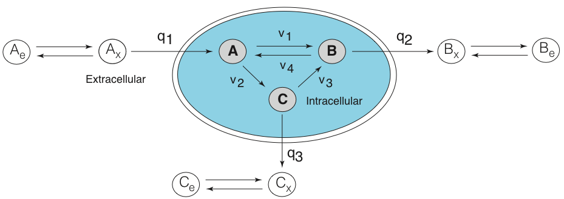

## Demonstration Flux Balance Analysis (FBA) problem
Flux balance analysis (along with a related approach called Metabolic Flux Analysis or MFA) is a widely used technique to estimate intracellular fluxes (reaction rates, typically in units of mmol/gDW-hr) given measurements of the specific uptake and secretion rates into/from a cell. Flux balance analysis is posed as a Linear Programming (LP) problem where the stoichiometric material balances, and bounds on the permissible values of the fluxes serve as constraints on the calculation.
For more information on flux balance analysis see:

[Orth et al, (2010) What is flux balance analysis? Nat. Biotechnology, 28:245-248](https://www.ncbi.nlm.nih.gov/pmc/articles/PMC3108565/).

### Installation and Requirements
You can download this FBA example repository as a zip file, or clone or pull it by using the command (from the command-line):

	$ git pull https://github.com/varnerlab/CHEME7770-SimpleFBA-Problem

or

	$ git clone https://github.com/varnerlab/CHEME7770-SimpleFBA-Problem

To execute the flux balance analysis calculation, [Julia](https://julialang.org) must be installed on your machine along with the
the Julia plugin for the [GLPK](https://github.com/JuliaOpt/GLPK.jl) linear programming solver. To install the GLPK program issue the command:

  	julia> Pkg.add("GLPK")

in the Julia REPL.

### Example problem

The abstracted metabolic network has four intracellular reactions and three intracellular metabolites A, B and C which can be exchanged with the extracellular environment.
